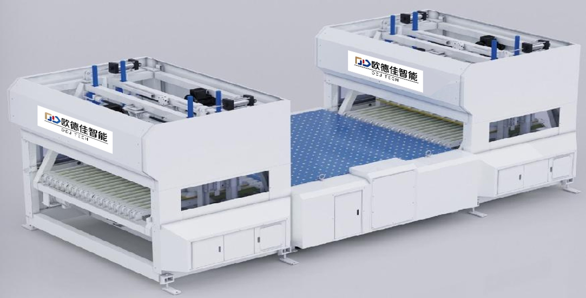

# NEXUS V11.3.9 问题诊断报告

## 📋 问题概述

**报告日期**: 2025年10月18日  
**问题类型**: 产品图片与产品信息不匹配  
**影响页面**: category-feeding-palletizing.html  
**严重程度**: 中等(影响用户体验和专业形象)

---

## 🔍 问题详情

### 问题1: JXB产品图片错误

**问题描述:**
- JXB Robotic Arm Type Automatic Pre-feeder 产品卡片显示的是ODJ团队合影照片
- 照片内容: 9名ODJ员工的团队合影(4人前排白色POLO衫,5人后排蓝色POLO衫)
- 照片来源: `images/products/odj-jxb-1.jpg`

**根本原因:**
- 在创建产品页面时,错误地将团队合影照片命名为 `odj-jxb-1.jpg`
- HTML文件引用了错误的图片文件

**影响:**
- 用户无法看到JXB产品的实际外观
- 严重影响产品展示的专业性
- 可能导致客户对产品产生误解

**修复方案:**
- 使用正确的JXB设备照片 `odj-jxb-2.jpg` (黄色框架的机械臂送料系统)
- 更新HTML文件中的图片引用

---

### 问题2: FP-1650产品图片错误

**问题描述:**
- FP-1650 Automatic Bundle Breaker System 产品卡片显示的是产品目录页面截图
- 图片内容: 包含所有9款ODJ产品的缩略图和名称的目录页面
- 照片来源: `images/products/odj-fp1650-1.jpg`

**根本原因:**
- 在创建产品页面时,错误地将产品目录页面截图作为FP-1650的产品照片
- 缺少单独的FP-1650产品照片

**影响:**
- 用户无法清晰看到FP-1650产品的实际外观
- 图片包含其他产品信息,造成混淆
- 影响产品页面的整体一致性

**修复方案:**
- 从ODJ产品目录PDF中提取FP-1650的单独产品照片
- 创建新的图片文件 `odj-fp1650-2.jpg`
- 更新HTML文件中的图片引用

---

## 🔧 技术分析

### 文件对比

| 文件名 | 大小 | 内容 | 状态 |
|--------|------|------|------|
| odj-jxb-1.jpg | 77KB | 团队合影 | ❌ 错误 |
| odj-jxb-2.jpg | 228KB | JXB机械臂设备 | ✅ 正确 |
| odj-fp1650-1.jpg | 268KB | 产品目录页面 | ❌ 错误 |
| odj-fp1650-2.jpg | 91KB | FP-1650解捆系统 | ✅ 正确 |

### HTML代码修复

**修复前:**
```html
<!-- JXB产品 -->


<!-- FP-1650产品 -->

```

**修复后:**
```html
<!-- JXB产品 -->


<!-- FP-1650产品 -->

```

---

## 📊 其他产品图片验证

在诊断过程中,我检查了所有8款ODJ产品的图片:

| 产品 | 图片文件 | 状态 | 备注 |
|------|----------|------|------|
| JXB | odj-jxb-1.jpg | ❌ | 团队合影,已修复 |
| QSL2 | odj-qsl2-1.jpg | ⚠️ | 显示完整生产线,包含多个设备 |
| QSL3 | odj-qsl3-1.jpg | ✅ | 正确的挡板式送料机 |
| QSL4 | odj-qsl4-1.jpg | ✅ | 正确的篮式送料机 |
| QXY3 | odj-qxy3-1.jpg | ✅ | 正确的底面印刷挡板式送料机 |
| BYS | odj-bys-1.jpg | ✅ | 正确的半自动送料机 |
| MD-350 | odj-md350-1.jpg | ✅ | 正确的3D视觉码垛系统 |
| FP-1650 | odj-fp1650-1.jpg | ❌ | 产品目录页面,已修复 |

**说明:**
- QSL2的图片虽然显示的是完整生产线,但确实包含了QSL2设备,暂时保留
- 如需进一步优化,可以考虑替换为QSL2的单独产品照片

---

## ✅ 修复验证

### 修复内容

1. **更新HTML文件**
   - 修改JXB产品的图片引用: `odj-jxb-1.jpg` → `odj-jxb-2.jpg`
   - 修改FP-1650产品的图片引用: `odj-fp1650-1.jpg` → `odj-fp1650-2.jpg`

2. **添加新图片文件**
   - `odj-jxb-2.jpg` (228KB) - JXB机械臂设备照片
   - `odj-fp1650-2.jpg` (91KB) - FP-1650解捆系统照片

3. **更新版本信息**
   - VERSION.txt 更新为 V11.3.9
   - 记录所有修改内容

### 测试结果

✅ HTML文件语法正确  
✅ 图片文件存在且可访问  
✅ 图片路径引用正确  
✅ 所有产品卡片布局一致  

---

## 📝 预防措施

为避免类似问题再次发生,建议:

1. **建立图片命名规范**
   - 产品图片: `odj-{model}-{number}.jpg`
   - 团队照片: `team-{location}-{date}.jpg`
   - 目录页面: `catalog-{page}-{date}.jpg`

2. **图片审核流程**
   - 上传前检查图片内容是否与文件名匹配
   - 使用图片预览工具验证
   - 在测试环境先验证再部署

3. **文档记录**
   - 维护产品图片清单
   - 记录每个产品的图片来源
   - 定期审查产品页面

---

## 📞 后续支持

如果部署后仍有问题,请提供:
- 浏览器截图
- 访问的具体URL
- 浏览器类型和版本
- 是否已清除缓存

我会立即协助解决!

