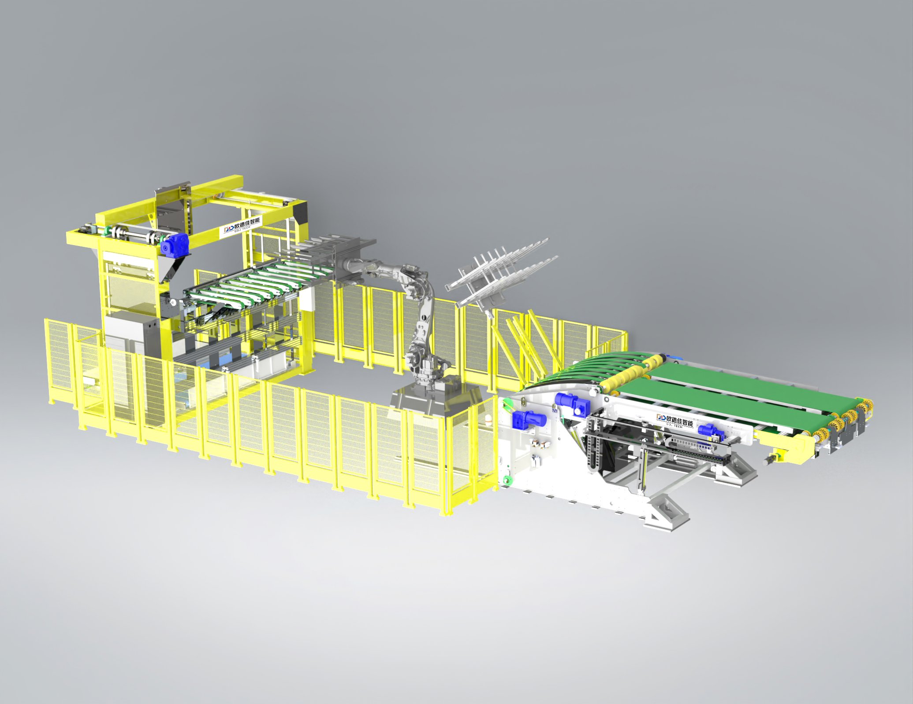
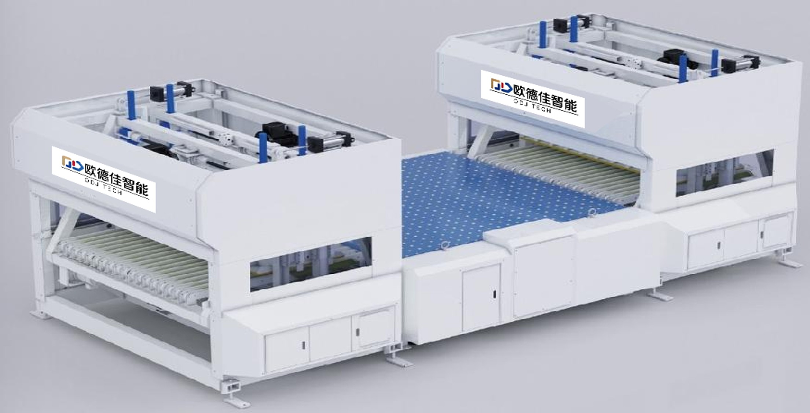

# NEXUS V11.4.0 增量更新包

## 更新日期
2025年10月18日

## 更新内容

本次更新**彻底修复**了ODJ产品图片在所有页面中的不匹配问题,包括:
- ✅ **Feeding & Palletizing Systems分类页面** (category-feeding-palletizing.html)
- ✅ **ODJ公司详情页面** (company-detail.html,通过products-complete.json)

---

## 修复的问题

### 1. JXB Robotic Arm Type Automatic Pre-feeder

**问题描述:**
- 在分类页面和公司页面都显示ODJ团队合影照片
- 用户无法看到JXB机械臂设备的实际外观

**修复方案:**
- 更新`category-feeding-palletizing.html`中的图片引用
- 更新`products-complete.json`中的图片顺序
- 现在显示正确的JXB机械臂设备照片(黄色框架的自动送料系统)

### 2. FP-1650 Automatic Bundle Breaker System

**问题描述:**
- 在分类页面和公司页面都显示产品目录页面截图
- 图片包含所有9款产品的缩略图,造成混淆

**修复方案:**
- 从ODJ产品目录PDF中提取FP-1650的单独产品照片
- 更新`category-feeding-palletizing.html`中的图片引用
- 更新`products-complete.json`中的图片配置
- 现在显示正确的FP-1650白色双模块自动解捆系统照片

---

## 更新的文件

```
category-feeding-palletizing.html       (16KB) - 更新了JXB和FP-1650的图片引用
data/products-complete.json             (55KB) - 更新了JXB和FP-1650的图片配置
images/products/odj-jxb-2.jpg          (228KB) - JXB机械臂设备照片
images/products/odj-fp1650-2.jpg        (91KB) - FP-1650解捆系统照片
VERSION.txt                             (620B) - 版本信息
```

---

## 部署说明

### 方法一:通过GitHub网页界面上传(推荐)

#### 步骤1: 上传HTML和JSON文件

1. 访问您的GitHub仓库: https://github.com/nexusglobal/nexusglobal.asia

2. **上传HTML文件**:
   - 点击仓库根目录的 **"Add file"** → **"Upload files"**
   - 上传 `category-feeding-palletizing.html`
   - 上传 `VERSION.txt`
   - 提交信息: `Update V11.4.0: Fix ODJ product images (part 1)`
   - 点击 **"Commit changes"**

3. **上传JSON文件**:
   - 进入 `data/` 目录
   - 点击 **"Add file"** → **"Upload files"**
   - 上传 `products-complete.json`
   - 提交信息: `Update V11.4.0: Fix ODJ product images (part 2)`
   - 点击 **"Commit changes"**

#### 步骤2: 上传图片文件

1. 进入 `images/products/` 目录
2. 点击 **"Add file"** → **"Upload files"**
3. 上传 `odj-jxb-2.jpg` 和 `odj-fp1650-2.jpg`
4. 提交信息: `Update V11.4.0: Add correct ODJ product images`
5. 点击 **"Commit changes"**

#### 步骤3: 等待部署完成

- GitHub Actions会自动开始部署
- 等待1-3分钟,直到看到绿色✅标记

#### 步骤4: 验证结果

1. **验证分类页面**:
   - 访问: https://nexusglobal.asia/category-feeding-palletizing.html
   - 按 **Ctrl+Shift+R** (Windows) 或 **Cmd+Shift+R** (Mac) 强制刷新
   - 检查JXB和FP-1650的产品图片

2. **验证公司页面**:
   - 访问: https://nexusglobal.asia/company-detail.html?id=odj&type=supplier
   - 按 **Ctrl+Shift+R** 强制刷新
   - 检查"Products & Solutions"部分的JXB和FP-1650图片

---

### 方法二:通过Git命令行

```bash
# 克隆仓库
git clone https://github.com/nexusglobal/nexusglobal.asia.git
cd nexusglobal.asia

# 复制更新文件
cp /path/to/category-feeding-palletizing.html ./
cp /path/to/VERSION.txt ./
cp /path/to/products-complete.json ./data/
cp /path/to/odj-jxb-2.jpg ./images/products/
cp /path/to/odj-fp1650-2.jpg ./images/products/

# 提交并推送
git add .
git commit -m "Update V11.4.0: Complete fix for ODJ product image mismatches"
git push origin main
```

---

## 验证清单

部署完成后,请验证以下内容:

### ✅ 分类页面 (category-feeding-palletizing.html)

| 产品 | 预期图片 |
|------|----------|
| JXB | 黄色框架的机械臂送料系统 ✅ |
| QSL2 | 斜坡式自动送料机 ✅ |
| QSL3 | 挡板式自动送料机 ✅ |
| QSL4 | 篮式自动送料机 ✅ |
| QXY3 | 底面印刷挡板式送料机 ✅ |
| BYS | 半自动送料机 ✅ |
| MD-350 | 3D视觉AI智能码垛系统 ✅ |
| FP-1650 | 白色双模块自动解捆系统 ✅ |

### ✅ 公司页面 (company-detail.html?id=odj&type=supplier)

| 产品 | 预期图片 |
|------|----------|
| JXB | 黄色框架的机械臂送料系统 ✅ |
| FP-1650 | 白色双模块自动解捆系统 ✅ |
| 其他产品 | 与分类页面一致 ✅ |

---

## 技术说明

### 修复原理

**问题根源:**
- `category-feeding-palletizing.html` 直接引用图片路径
- `company-detail.html` 通过 `products-complete.json` 动态加载产品数据
- 两个地方的图片配置都指向了错误的文件

**修复方案:**
1. 在HTML文件中直接修改图片路径
2. 在JSON文件中调整`images`数组的顺序,将正确的图片放在第一位
3. 添加新的正确产品图片文件

### 文件变更详情

**category-feeding-palletizing.html:**
```html
<!-- 修复前 -->



<!-- 修复后 -->


```

**products-complete.json:**
```json
// 修复前
{
  "id": "pfjxb001",
  "images": ["images/products/odj-jxb-1.jpg", "images/products/odj-jxb-2.jpg"]
}

// 修复后
{
  "id": "pfjxb001",
  "images": ["images/products/odj-jxb-2.jpg", "images/products/odj-jxb-1.jpg"]
}
```

---

## 故障排除

### 问题1: 上传后图片仍然不正确

**解决方案:**
- 清除浏览器缓存
- 使用无痕模式访问
- 等待CDN缓存更新(最多5分钟)
- 确认所有文件都已成功上传

### 问题2: JSON文件上传后网站出错

**解决方案:**
- 检查JSON文件格式是否正确(使用JSON验证工具)
- 确认文件编码为UTF-8
- 检查浏览器控制台的错误信息

### 问题3: 图片显示破损图标

**解决方案:**
- 确认图片文件已上传到 `images/products/` 目录
- 检查文件名是否正确: `odj-jxb-2.jpg` 和 `odj-fp1650-2.jpg`
- 确认文件路径大小写匹配

---

## 支持

如有问题,请联系技术支持并提供:
1. 浏览器截图
2. 访问的具体URL
3. 浏览器控制台的错误信息
4. GitHub Actions部署日志

